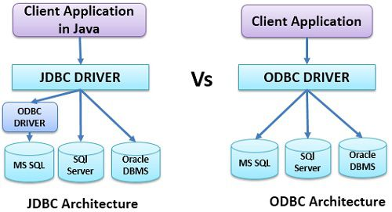
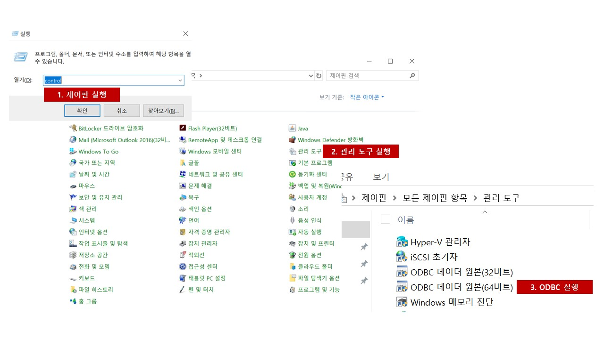
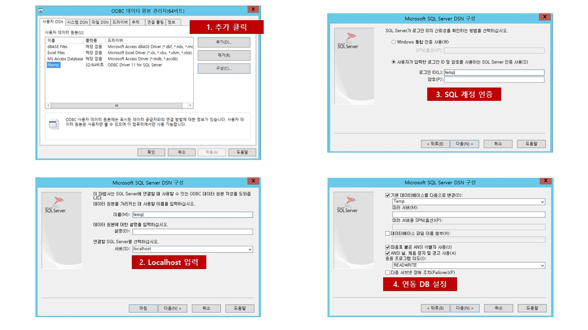

```{r setup, include=FALSE}
knitr::opts_chunk$set(echo = TRUE)
```

# 1.개요
    
## DB를 사용하는 이유
간단히 파일기반으로 데이터를 저장할 수 있으나 여러 시스템에서 데이터를 공유해야 할 경우 접근성이 떨어지고 여러 소스에서 데이터가 중복될 경우 관리하기 어려운 문제가 있어 DB 기반으로 시스템을 구축하는 것이 효과적임.


## DB의 종류(https://inyl.github.io/programming/2017/05/09/database.html)
과거에는 RDBMS 기반의 시스템이 주류를 이루었으나 분산 처리 시스템이 발전하면서 NOSQL이 등장하였으며 현재는 목적에 따라 다양하게 골라서 이용할 수 있음. 스터디에서 공부하려는 DB는 파일 DB 형태의 sqlite3와 RDBMS 인 MSSQL 임.
    
    

# 2.R에서 DB사용해 보기
    

## 파일DB
    
파일DB는 DB가 파일형태로 저장되지만 DBMS의 장점인 트랜젝션, 보안 등의 장점을 제공해주는 DB를 의미함. 대표적으로 sqlite가 있음
    

### 라이브러리 사용 하는 방법

```{r}
# install.packages("DBI")
library(RSQLite)

datasetsDb()

# RSQLite Test
# 참고 자료 : https://cran.r-project.org/web/packages/RSQLite/vignettes/RSQLite.html

# DB생성
mydb <- dbConnect(SQLite(), "testDB.sqlite")

# DB 연결 해제
dbDisconnect(mydb)
unlink("my-db.sqlite")

# 메모리에 존재하는 임시 DB 생성
mydb <- dbConnect(SQLite(), "")
str(mydb)
dbDisconnect(mydb)

# DB에 데이터 프레임 기록하기
# DB에 저장되는 형태는 데이터 프레임과 유사
mydb <- dbConnect(RSQLite::SQLite(), "")
dbWriteTable(mydb, "mtcars", mtcars)
dbWriteTable(mydb, "iris", iris)
dbListTables(mydb)

# DB의 테이블 읽어오기
dbGetQuery(mydb, 'select * from mtcars limit5')
dbGetQuery(mydb, 'select * from iris where "Sepal.Length" < 4.6')

# 배치로 읽어오는 쿼리
rs <- dbSendQuery(mydb, 'SELECT * FROM mtcars')
while (!dbHasCompleted(rs)) {
  df <- dbFetch(rs, n = 10)
  print(nrow(df))
}

# 파라미터를 바꿔가며 처리하기
rs <- dbSendQuery(mydb, 'SELECT * FROM iris WHERE "Sepal.Length" < :x')
dbBind(rs, param = list(x = 4.5))
nrow(dbFetch(rs))
dbClearResult(rs)

# SQL 구문 실행하기
dbExecute(mydb, 'DELETE FROM iris WHERE "Sepal.Length" < 4')
rs <- dbSendStatement(mydb, 'DELETE FROM iris WHERE "Sepal.Length" < :x')
dbBind(rs, param = list(x = 4.5))
dbGetRowsAffected(rs)
dbClearResult(rs)

```
    
## RDBMS
    
### ODBC(Open DataBase Connectivity)
    
마이크로소프트가 만든 데이터베이스에 접근하기 위한 소프트웨어 표준규격으로 ODBC를 이용하면 각 연결된 데이터베이스가 무엇인지 상관 없이 동일한 방법으로 DB를 컨트롤 할 수 있음

### JDBC(Java Database Connectivity)
    
자바에서 데이터베이스를 접속할 수 있도록 하는 자바 API이다. ODBC와 마찬가지로 JDBC를 이용하면 JDBC에 연결된 DB의 종류에 상관없이 동일한 방법으로 DB를 컨트롤 할 수 있음

    


### ODBC 설정 방법(DB 사이드)
    
1. DB 설치(이미 설치 되어 있다고 가정)
2. ODBC Driver 셋팅(R이 설치된 PC)
    + 윈도우 OS의 경우 드라이버가 기본적으로 설치되어 있음
    + ODBC 설정 메뉴 진입
    + 접근하고자 하는 DB 정보 설ㅈ어
3. R에서 DB 접근 하기
    
<br>

#### DB 설정 메뉴 진입하기

    
    
#### DB 설정하기

    

### SQL 명령문

SQL의 명령문은 기본적으로 CREATE, READ, UPDATE, DELETE 로 이루어져 있으며 앞글자만 졸여서 CRUD로 표현한다. 가장 많이 사용하는 명령문은 READ 문이며 다음과 같은 문법을 따른다.

```{sql eval = F}

--CREATE
insert into [TARGET_TABLE] select * from [UPLOAD_TABLE]
  
--READ
select * from [TABLE]

--UPDATE
update [TABLE] set COLUMN = 1 where COLUMN = 2

--DELETE
delete from [TABLE] where COLUMN >= 3

```

    
### R코드
    
R에서는 SQL 명령문을 그대로 쓸 수 있으며 개별 명령을 문을 실행하려면 다음과 같이 사용한다.
    

```{r eval = F}

# ODBC 라이브러리 로드
library(RODBC)

# DB 접속 계정 정보를 설정
con <- odbcConnect("DSN", uid = "userid", pw="password")

# DB의 TABLE 읽어오기
df <- sqlFetch(con, sqtable = "TABLENAME")

# R의 데이터프레임을 TABLE로 저장하기
sqlSave(con, df, tablename = "TABLENAME", append = FALSE)

# R의 데이터 프레임으로 TABLE 업데이트 하기
# 업데이트 하는 기준 컬럼을 지정해야 함
sqlUpdate(con, df, tablename = "TABLENAME", index = NULL)

# 테이블 삭제
sqlDrop(con, sqtable = "TABLENAME")

# 테이블 안에 모든 ROW 삭제
sqlClear(con, sqtable = "TABLENAME")

# sqlQuery 명령어를 사용하면 보다 R안에서 SQL 구문을 보다 범용적으로 사용할 수 있음
query <- paste0(" SELECT TOP 1000 [Country]
                                ,[keywordType]
                                ,[subKeywordType]
                                ,[keyword]
                  FROM [Temp].[dbo].[keywordDic]")

dataset <- sqlQuery(con, query)

```


# 끝
